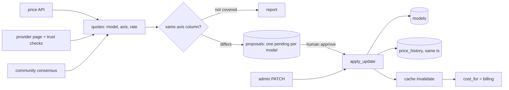

# model-price-registry

Model prices as audited, runtime-editable data, kept honest by provider sync that may only *propose*.

> A clean-room re-implementation of work I designed and built for a production
> multi-tenant AI workspace platform. No employer code; all names and data are fictional.

[](https://github.com/Tayyab-Bilal/model-price-registry/actions/workflows/ci.yml)

## The problem

Every AI charge in a workspace app is computed from one model price table. Changing a price meant a
migration, a review and a deploy. Meanwhile providers change prices without notice, and a wrong rate
is invisible from inside the system: every charge computed from it is self-consistent, so nothing
errors and nothing fails reconciliation. The only way to find out is to ask the provider.

This repo makes prices data, not code. They are editable at runtime through one audited write path.
Automated sources watch the providers, but they can only file *drafts*; a human approves each one.
A misread page that writes through is a wrong charge nobody sees. A misread page that files a draft
is a line item somebody rejects.

## What it does

- **One audited write path.** `apply_update` (`registry.py`) is the only code that changes a rate. A
  `PATCH` route and every approval go through it; each change writes a before/after history row in
  the same transaction.
- **Validation on the merged row** (`validation.py`): no negatives, nothing that rounds to zero, cached
  never above input, never per token and per minute together, a reason is required. Omitted field =
  leave alone, explicit `null` = clear (`model_fields_set`).
- **Provenance per row** (`migration`, `admin`, `sync`) and a CI-style check (`checks.py`) that is exact
  for migration rows and invariant-only for runtime-edited rows.
- **Approval queue** (`proposals.py`): one pending draft per model (partial unique index), rates
  snapshotted per draft, stale approval refused, decisions final, bulk decisions capped at 200.
- **Three sources** (`sources/`): an OpenRouter-style API, a provider pricing page behind three trust
  checks, and a consensus of five community price shapes.
- **Billing axes** (`units.py`): every quote names its axis and is compared only with the column that
  holds that axis; unknown axes are reported as *not covered*.
- **Sync run lock and reaper**, dry run, shared exit code (`sync.py`).
- **Admin and trigger HTTP API** (`api.py`): 10 admin-only routes plus a sync trigger.
- **Insert-only seed** (`seed.py`) and a **guarded cached-rate backfill** (`backfill.py`).
- **Rate cache** with a 60 s TTL and explicit invalidation (`registry.py`).

## Quickstart

```bash
uv venv .venv && uv pip install -e ".[dev]"
.venv/bin/python examples/demo.py                                  # the whole story
.venv/bin/pytest -q                                                # tests, no network
.venv/bin/python -m model_price_registry.sync --db r.db --dry-run  # report only
```

The CLI creates and seeds `r.db` if it does not exist, then reads it read-only for the dry run.
Sources read recorded fixtures in `tests/fixtures/` (no network); model names are invented.

Excerpt of the demo output:

```text
2b. the page layout is fixed: same sync, now with the full provider page
sync report
  proposed     acme-chat-small    from provider_page [filed]
  not covered  acme-live-1        axis=audio_input_token
  not covered  acme-rerank-1      axis=rerank_search
...
4. a human approves the acme-chat-large draft
   bill is now $4.8
5. someone edits acme-code-pro by hand, then the older draft is approved
   conflict, refused: rates for acme-code-pro changed since proposal 2
```

## Usage guide

Change a price and see the bill change. This is the same `cost_for` that billing calls.

```python
from decimal import Decimal as D

from model_price_registry.db import connect
from model_price_registry.registry import Registry
from model_price_registry.seed import seed
from model_price_registry.validation import PriceUpdate

conn = connect()  # in memory; pass a file path to keep it
seed(conn)
reg = Registry(conn)
assert reg.cost_for("acme-code-pro", 1_000_000, 100_000) == D("2.8")
reg.update_price("acme-code-pro", PriceUpdate(output_per_mtok=D("9"), reason="renegotiated"), "alice")
assert reg.cost_for("acme-code-pro", 1_000_000, 100_000) == D("2.9")
assert reg.get_model("acme-code-pro").provenance == "admin"
```

File a draft and approve it. Automation would call `file_proposal`; a human calls `approve`.

```python
from model_price_registry.proposals import file_proposal, approve

outcome, pid = file_proposal(reg, "acme-chat-small", {"input_per_mtok": D("0.30")}, "api")
assert outcome == "filed"
approve(reg, pid, "bob")
assert reg.get_model("acme-chat-small").rates["input_per_mtok"] == D("0.3")
```

Run a dry-run sync over the recorded fixtures. More in [docs/usage.md](docs/usage.md), and the HTTP
routes in [docs/api.md](docs/api.md).

```python
from datetime import UTC, datetime

from model_price_registry.sources.fixtures import fixture_sources
from model_price_registry.sync import run_sync

ids = {r["model_id"] for r in conn.execute("SELECT model_id FROM models")}
report = run_sync(reg, fixture_sources("tests/fixtures", ids), datetime.now(UTC), dry_run=True)
assert report.dry_run and report.proposed
```

## How it works



1. A trigger (the CLI, or `POST /admin/sync/trigger` called by an outside scheduler) calls `run_sync`.
   The `sync_runs` row is the lock; a stale `running` row is reaped, a live one gives 409.
2. Each source returns quotes. The page source first applies its trust checks; the consensus source
   keeps a rate only where two or more databases state it exactly.
3. Each quote is compared with the registry column on its own axis. Same: nothing. Different: a
   draft. Unknown axis: reported as not covered.
4. `file_proposal` snapshots the current rates and files the draft (one pending per model).
5. A human approves or rejects. Approval re-reads the rates; if they differ from the snapshot it
   raises `StaleProposal` (HTTP 409). Otherwise decision and price change commit in one transaction,
   a history row is written, and the rate cache entry is dropped.

## Design decisions

1. **One audited write path.** Everything that changes a rate calls `apply_update`. *Rejected:* a
   direct `UPDATE` in each feature; one forgotten history row makes the audit trail untrustworthy.
2. **Nothing automated moves money.** Sources file drafts only. *Rejected:* auto-apply under a
   threshold; a misread page then becomes a wrong charge nobody sees.
3. **Validate the merged row, not just the touched fields.** A partial update can pass on its own and
   still break an invariant. This also stops an unapprovable draft being filed. *Rejected:* checking
   only the fields in the request.
4. **Integer micro-dollars.** Equality (snapshot checks, "did it change?") is exact. *Rejected:*
   floats (drift) and decimal text (string compare is not numeric compare).
5. **One pending draft per model via a partial unique index.** The database refuses a second one even
   if two workers race. *Rejected:* an application-level check-then-insert.
6. **Snapshot per draft; stale approval is 409.** The reviewer approved specific numbers. *Rejected:*
   applying the draft over whatever is there now, which silently overwrites a hand edit.
7. **Record and apply in one transaction.** A failed apply leaves the proposal pending; there is no
   window where a concurrent hand edit is overwritten. *Rejected:* mark decided, then apply.
8. **Bulk = one transaction per proposal, max 200.** One stale draft must not roll back the others.
   *Rejected:* all-or-nothing bulk.
9. **Provenance rule.** Migration rows must match the published list exactly; admin and sync rows are
   exempt from that exact comparison (they have legitimately moved) but never from the invariants.
   *Rejected:* exempting them from everything, or from nothing (CI would fail every price edit).
10. **Source ranking.** Consensus never overrides a provider-page draft (from the original design).
    Placing the API between them (consensus < api < page) is this repo's own choice. *Rejected:*
    last writer wins.
11. **Consensus or nothing.** At least two exact matches and no disagreement. *Rejected:* median or
    majority; two stale copies of the same old price can outvote one correct source.
12. **Billing axes.** Every quote carries an axis; unknown means *not covered*, never a guess. See the
    traps below. *Rejected:* "most common price".
13. **Insert-only seed.** The original system's startup seed rewrote rates on every start, undoing
    runtime changes. `ON CONFLICT DO NOTHING` makes a restart a no-op for existing rows.
14. **Backfill downgrade is a no-op.** Undoing it would restore the cached-token overcharge.
15. **Drafts, not writes, for the API source.** An OpenRouter-style price API quotes the default route for a model. In
    the original system a routing change once looked like a price doubling; review catches that.
16. **Run row is the lock, soft limit below the reaper.** A healthy run must never be reaped (see
    production-only items below).

Units and axis traps, each covered by a test with a fixture shaped like the real quote:

- **Realtime text vs audio:** a realtime model has two input rates, audio 8x the text one in the
  fixture. A "most common price" would propose 8x. The audio quote has no registry column: not covered.
- **Per second vs per minute:** a speech model priced per minute; a per-second quote converts by 60.
  A per-minute number mistaken for per-second is exactly 60x off in this data.
- **Rerank per search vs per token:** a per-search price compared with a per-token column is off by
  orders of magnitude (40,000x in the fixture). Not covered.
- **Cents per token on an audio model:** one source quotes cents; it is converted to dollars once and
  stays on the audio axis, never landing on a per-minute or text column.

## In production

Results of the original system, not measured by this repo:

- A manual re-check found 3 of 8 models drifted within 9 days: one 27% under cost, one 47% over.
- Automated price coverage rose from about half to about three quarters of models.
- The first live dry run found no consensus drift (independent confirmation) and 4 genuine API-source
  drifts, filed for review.
- 228 tests, and 36 mutations each confirmed to fail a specific test.
- A startup seed undid runtime price changes (25 of 32 rows were in scope); fixed with the
  insert-only seed and a provenance guard.
- 18 of 32 models had no cached rate on a fresh database, billing cached tokens at the full input
  rate; fixed with a guarded backfill whose downgrade is a no-op.
- Status: merged; the scheduled sync is pending backend integration.

Production-only, not in this repo: dry runs against live providers; the task runner's soft time
limit set below the reaper threshold, so a live run is never freed; invalidating the rate cache
across workers so a change is visible everywhere within 60 s (here each process has its own cache
and lags by at most the TTL, shown in a test); Postgres `SELECT ... FOR UPDATE`, `NUMERIC` and
Alembic; mutation testing; real HTML extractors for three provider pages and fetchers for five
community databases.

What this repo simplifies: SQLite and `BEGIN IMMEDIATE` for Postgres, recorded fixtures for live
sources, one generic table parser for three page extractors, five hand-written shapes for five
databases, a fake `require_admin` for real authentication.

## Testing

```bash
.venv/bin/pytest -q    # no network, about 2 s
```

| Invariant | Test |
|---|---|
| History row commits with the price, or neither does | `test_update_writes_history_in_same_transaction` |
| Cache is invalidated on write and expires at the TTL | `test_cache_invalidated_on_update`, `test_cache_expires_after_ttl` |
| Another worker lags by at most the TTL | `test_two_workers_see_a_change_within_the_ttl` |
| Price change changes the bill | `test_changing_price_changes_the_bill` |
| Validation set, omitted vs null | `tests/test_validation.py` |
| One pending per model, by index | `test_one_pending_per_model_enforced_by_index` |
| Stale approval refused, decisions final | `test_stale_approval_refused`, `test_decision_is_final` |
| Failed apply leaves proposal pending | `test_failed_apply_leaves_proposal_pending` |
| One stale draft does not roll back a bulk call | `test_bulk_one_stale_does_not_roll_back_others` |
| Bulk capped at 200 | `test_bulk_decisions_capped_at_200`, `test_bulk_over_200_is_422` |
| Consensus never overrides a page draft | `test_consensus_never_overrides_a_provider_page_draft` |
| Page trust checks | `test_page_trust_checks_*` |
| Consensus needs two exact matches | `test_consensus_needs_two_exact`, `test_consensus_disagreement_proposes_nothing` |
| Axis traps | `tests/test_traps.py` |
| Run row is the lock, stale run reaped | `test_running_row_blocks_second_run`, `test_stale_run_reaped` |
| Dry run writes nothing; CLI on a fresh path | `test_dry_run_writes_nothing`, `test_dry_run_cli_on_a_fresh_path_creates_and_seeds` |
| Seed never overwrites runtime rows | `test_seed_never_overwrites_admin_rows` |
| Provenance rule | `test_runtime_edited_rows_are_exempt_from_exact_check`, `test_runtime_edited_rows_are_still_held_to_invariants` |
| Backfill guarded, downgrade no-op | `test_backfill_is_guarded`, `test_backfill_downgrade_is_a_no_op` |
| All 11 routes admin-only; 409 and 422 mapping | `tests/test_api.py` |
| Docs snippets run | `tests/test_docs.py` |

## Limits & known trade-offs

- `BEGIN IMMEDIATE` serialises all writers; Postgres would lock only the model row.
- The rate cache is per process: other workers lag up to the TTL (60 s).
- Rates round half-up at 6 decimals; anything smaller is rejected, not stored.
- The API shares one SQLite connection on the event-loop thread. Use a pool for real traffic.
- `POST /admin/sync/trigger` runs the sync inline; production hands it to a task runner.
- The sync trigger has no schedule: an outside scheduler calls it (one scheduler, not two).
- Dependencies: `pydantic>=2` is the only runtime dependency. `fastapi` (extra `api`) is needed only
  for `api.py`; `httpx` and `pytest` are used by the tests.
- Audio-token and rerank-per-search quotes are reported as not covered; the registry has no column
  to compare them with, so they never become drafts.

## Project layout

```text
src/model_price_registry/
  db.py            schema, connection, transactions, money helpers
  validation.py    invariants and PriceUpdate (omitted vs null)
  registry.py      apply_update (the write path), Registry, RateCache, cost_for
  proposals.py     approval queue, source ranking, bulk decisions
  sync.py          run lock, reaper, report, dry-run CLI
  units.py         billing axes and quote comparison
  sources/         api, provider page, community consensus, fixture wiring
  seed.py          insert-only startup seed
  backfill.py      guarded cached-rate backfill
  checks.py        CI-style provenance-aware rate check
  api.py           FastAPI admin and trigger router
tests/             one file per area, fixtures in tests/fixtures
examples/demo.py   end-to-end walkthrough
docs/              usage.md, api.md
```
